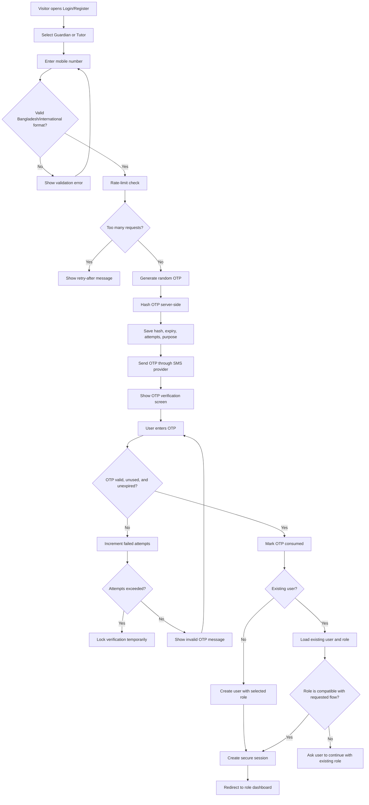
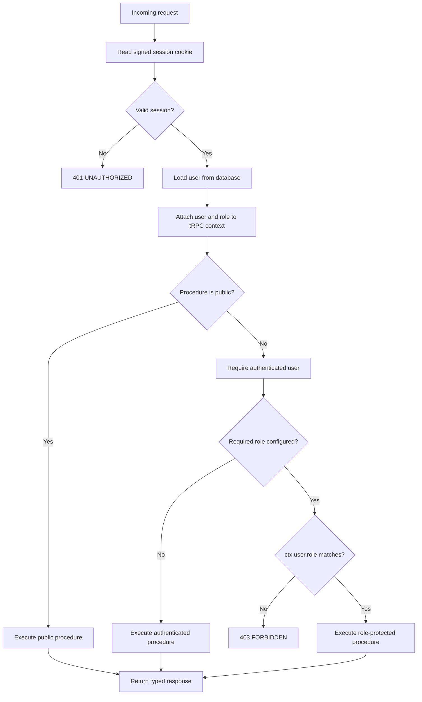
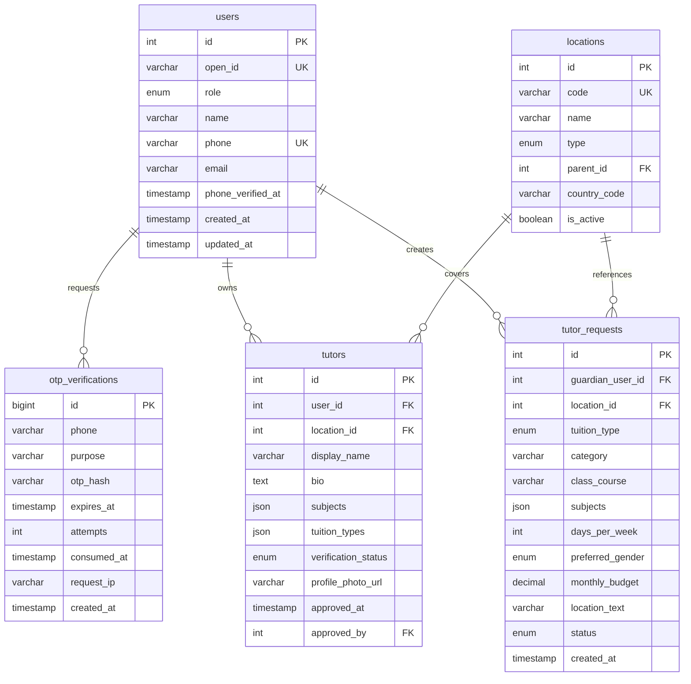

# Connect Tutors BD: Mobile OTP Authentication ও Role-Based Access Control

**প্রস্তুতকারক:** Manus AI  
**প্রকল্প:** Connect Tutors BD / Connecttutorsbd.com  
**প্রযুক্তি ভিত্তি:** React, Express, tRPC, Drizzle ORM এবং MySQL

## ১. প্রস্তাবিত authentication policy

Connect Tutors BD-এর Bangladesh-first audience-এর জন্য Mobile OTP-কে primary sign-in method হিসেবে ব্যবহার করা হবে। ব্যবহারকারী প্রথমে mobile number দেবে, server একটি short-lived OTP তৈরি করবে, SMS provider-এর মাধ্যমে OTP পাঠাবে, এবং সঠিক OTP verify হলে session তৈরি হবে। Email optional recovery/contact field হিসেবে রাখা যেতে পারে, কিন্তু login-এর জন্য বাধ্যতামূলক হবে না।

> OTP কখনও plaintext হিসেবে database-এ রাখা যাবে না। OTP-এর hash, expiry time, attempt count এবং consumed status সংরক্ষণ করতে হবে।

প্রথম registration flow-তে ব্যবহারকারী **Guardian** অথবা **Tutor** role নির্বাচন করবে। **Admin role কখনও public registration form থেকে নির্বাচন করা যাবে না**। Admin account manually promoted হবে অথবা secure deployment configuration/owner process-এর মাধ্যমে তৈরি হবে।

| Role | Registration | Primary capability | গুরুত্বপূর্ণ নিষেধাজ্ঞা |
|---|---|---|---|
| Guardian | Mobile OTP | Tutor request তৈরি, নিজের request দেখা ও manage করা | Tutor verification বা admin settings পরিবর্তন করতে পারবে না |
| Tutor | Mobile OTP | Tutor profile তৈরি/সম্পাদনা, নিজের application status দেখা | অন্য Tutor-এর profile বা admin moderation পরিবর্তন করতে পারবে না |
| Admin | Manual/secure invite | Tutor approval, user moderation, location/content management | Public registration-এর মাধ্যমে তৈরি হবে না |

## ২. সম্পূর্ণ Mobile OTP flowchart



### Flow-এর গুরুত্বপূর্ণ সিদ্ধান্ত

একটি mobile number-এর সঙ্গে একটি primary account role থাকবে। একই account-কে Guardian এবং Tutor উভয় role দেওয়ার প্রয়োজন হলে `user_roles` আলাদা table ব্যবহার করা যাবে; তবে প্রথম release-এ একটি account-এর একটি primary role রাখলে authorization সহজ, audit পরিষ্কার এবং ভুল permission কম হবে।

Registration-এর সময় role selection কেবল account তৈরির জন্য ব্যবহৃত হবে। Existing Tutor যদি Guardian হিসেবে login করার চেষ্টা করে, system নতুন account তৈরি না করে existing role সম্পর্কে পরিষ্কার message দেখাবে। Admin role-এর জন্য আলাদা invitation বা manual promotion flow থাকবে।

## ৩. Role-based access-control flowchart



Frontend route protection convenience এবং user experience-এর জন্য থাকবে; কিন্তু **মূল security সবসময় server-side tRPC procedure-এ enforce করতে হবে**। Frontend-এর button লুকানো কোনো authorization boundary নয়।

## ৪. Database model

বর্তমান `users` table-এ role field থাকবে। OTP-এর জন্য পৃথক table ব্যবহার করা হবে, যাতে audit, expiry এবং rate limiting করা যায়। Session যদি existing OAuth/session infrastructure-এ থাকে, OTP verification-এর পরে একই session mechanism ব্যবহার করা যাবে।



### Suggested Drizzle role and OTP fields

```ts
export const userRoleEnum = mysqlEnum("user_role", [
  "guardian",
  "tutor",
  "admin",
]);

export const otpPurposeEnum = mysqlEnum("otp_purpose", [
  "login",
  "registration",
  "change_phone",
]);

export const otpVerifications = mysqlTable("otp_verifications", {
  id: bigint("id", { mode: "number" }).primaryKey().autoincrement(),
  phone: varchar("phone", { length: 32 }).notNull(),
  purpose: otpPurposeEnum("purpose").notNull(),
  otpHash: varchar("otp_hash", { length: 128 }).notNull(),
  expiresAt: timestamp("expires_at", { mode: "date" }).notNull(),
  attempts: int("attempts").notNull().default(0),
  consumedAt: timestamp("consumed_at", { mode: "date" }),
  requestIp: varchar("request_ip", { length: 64 }),
  createdAt: timestamp("created_at", { mode: "date" }).defaultNow().notNull(),
});
```

প্রকল্পের বিদ্যমান schema-এর naming convention অনুযায়ী `int`, `varchar`, `timestamp`, `mysqlEnum` এবং foreign-key relation ব্যবহার করতে হবে। Migration generate করার পরে SQL review করে database-এ প্রয়োগ করতে হবে। OTP table-এ পুরোনো consumed বা expired rows-এর cleanup আলাদা scheduled job হিসেবে পরে যোগ করা যাবে।

## ৫. Backend code structure

```text
server/
  _core/
    context.ts              # session থেকে ctx.user তৈরি
    trpc.ts                 # public/protected/role guards
    otp.ts                  # OTP hash, compare, expiry helpers
    sms.ts                  # SMS provider adapter
    session.ts              # signed session create/clear helpers
  auth/
    otp.service.ts          # requestOtp, verifyOtp business logic
    otp.router.ts           # sendOtp, verifyOtp procedures
    auth.service.ts         # user upsert, role checks
  routers.ts                # root router composition
  db.ts                     # Drizzle query helpers
  auth.otp.test.ts          # OTP expiry, attempt, consume tests
  auth.rbac.test.ts         # procedure authorization tests
```

### tRPC procedure structure

```ts
export const authRouter = router({
  requestOtp: publicProcedure
    .input(requestOtpSchema)
    .mutation(({ input, ctx }) =>
      otpService.requestOtp({
        phone: input.phone,
        purpose: input.purpose,
        requestedRole: input.role,
        requestIp: getRequestIp(ctx.req),
      })
    ),

  verifyOtp: publicProcedure
    .input(verifyOtpSchema)
    .mutation(({ input, ctx }) =>
      otpService.verifyOtp({
        phone: input.phone,
        otp: input.otp,
        role: input.role,
        response: ctx.res,
      })
    ),

  me: publicProcedure.query(({ ctx }) => ctx.user),
  logout: protectedProcedure.mutation(({ ctx }) => clearSession(ctx.res)),
});

export const guardianProcedure = protectedProcedure.use(({ ctx, next }) => {
  if (ctx.user.role !== "guardian") {
    throw new TRPCError({ code: "FORBIDDEN" });
  }
  return next({ ctx });
});

export const tutorProcedure = protectedProcedure.use(({ ctx, next }) => {
  if (ctx.user.role !== "tutor") {
    throw new TRPCError({ code: "FORBIDDEN" });
  }
  return next({ ctx });
});

export const adminProcedure = protectedProcedure.use(({ ctx, next }) => {
  if (ctx.user.role !== "admin") {
    throw new TRPCError({ code: "FORBIDDEN" });
  }
  return next({ ctx });
});
```

### Procedure-to-role mapping

| Procedure | Access | উদ্দেশ্য |
|---|---|---|
| `auth.requestOtp` | Public | OTP request করা |
| `auth.verifyOtp` | Public | OTP verify করে session তৈরি করা |
| `auth.me` | Public/session-aware | বর্তমান user জানা |
| `tutorRequests.create` | Guardian | Tutor request persist করা |
| `tutorRequests.mine` | Guardian | নিজের request দেখা |
| `tutors.create` | Tutor | নিজের tutor profile শুরু করা |
| `tutors.updateMine` | Tutor | নিজের profile edit করা |
| `tutors.list` | Public | Approved tutor listing দেখা |
| `admin.tutors.review` | Admin | Tutor approve/reject করা |
| `admin.users.updateRole` | Admin | Role management করা |
| `admin.locations.update` | Admin | Location catalog manage করা |

## ৬. Frontend code structure

```text
client/src/
  pages/
    Auth.tsx                  # role selection + phone input + OTP screen
    Account.tsx               # protected role-aware account home
    GuardianDashboard.tsx     # Guardian-only UI
    TutorDashboard.tsx        # Tutor-only UI
    AdminDashboard.tsx        # Admin-only UI
  components/
    auth/
      PhoneInput.tsx
      OtpInput.tsx
      RoleSelector.tsx
      ProtectedRoute.tsx
      RoleGate.tsx
  hooks/
    useAuth.ts                # current session and logout
    useOtpAuth.ts             # request/verify OTP state machine
  lib/
    trpc.ts
```

### OTP screen state machine

```ts
type OtpAuthState =
  | { step: "choose-role" }
  | { step: "enter-phone"; role: "guardian" | "tutor" }
  | { step: "verify-otp"; role: "guardian" | "tutor"; phone: string; expiresAt: number }
  | { step: "success"; role: "guardian" | "tutor" }
  | { step: "error"; message: string };
```

`Auth.tsx`-এ role selection, phone input, resend countdown, OTP input, error message এবং success redirect থাকবে। OTP verification success হলে server session cookie তৈরি করবে; frontend নিজে cookie value পড়বে না বা localStorage-এ session token রাখবে না।

### Protected route wrapper

```tsx
function ProtectedRoute({
  roles,
  children,
}: {
  roles: Array<"guardian" | "tutor" | "admin">;
  children: React.ReactNode;
}) {
  const { user, loading } = useAuth({
    redirectOnUnauthenticated: true,
    redirectPath: "/login",
  });

  if (loading) return <AccountSkeleton />;
  if (!user) return null;
  if (!roles.includes(user.role)) return <AccessDenied />;

  return <>{children}</>;
}
```

Route protection example:

```tsx
<Route path="/guardian/dashboard">
  <ProtectedRoute roles={["guardian"]}>
    <GuardianDashboard />
  </ProtectedRoute>
</Route>

<Route path="/tutor/dashboard">
  <ProtectedRoute roles={["tutor"]}>
    <TutorDashboard />
  </ProtectedRoute>
</Route>

<Route path="/admin/dashboard">
  <ProtectedRoute roles={["admin"]}>
    <AdminDashboard />
  </ProtectedRoute>
</Route>
```

## ৭. Security requirements

OTP request endpoint-এ প্রতি phone number, IP এবং device/session অনুযায়ী rate limit রাখতে হবে। সাধারণ baseline হিসেবে একাধিক দ্রুত OTP request block করা, verification attempts সীমিত রাখা, expiry শেষে OTP invalid করা এবং successful verification-এর পরে OTP consumed করা প্রয়োজন। Exact limits SMS provider, traffic এবং abuse pattern দেখে production testing-এর পরে নির্ধারণ করতে হবে।

Mobile number database-এ normalized E.164-like format-এ রাখতে হবে, যেমন `+8801XXXXXXXXX`। OTP response-এ কখনও actual OTP, hash বা sensitive user details পাঠানো যাবে না। Login success-এর পরে secure, HttpOnly এবং appropriate SameSite cookie ব্যবহার করতে হবে। Production domain ও HTTPS ছাড়া OTP authentication চালু করা উচিত নয়।

Admin promotion public UI থেকে করা যাবে না। Admin procedure-এ server-side role check, audit log এবং confirmation step রাখা উচিত। NID বা অন্যান্য identity document S3/private storage-এ encrypted access policy সহ রাখা হবে; public tutor profile-এ document URL প্রকাশ করা যাবে না।

## ৮. বাস্তবায়নের ধাপ

| ধাপ | কাজ | ফলাফল |
|---|---|---|
| ১ | `users` role/phone fields review এবং `otp_verifications` schema যোগ | Database foundation |
| ২ | OTP hash, expiry, attempt ও consumed logic লেখা | Safe OTP service |
| ৩ | SMS provider adapter এবং environment secret যোগ | Real SMS delivery |
| ৪ | `requestOtp` ও `verifyOtp` tRPC procedures যোগ | End-to-end auth API |
| ৫ | Auth page-এ phone/OTP state machine বসানো | User-facing login/register |
| ৬ | `guardianProcedure`, `tutorProcedure`, `adminProcedure` চালু | Server-side RBAC |
| ৭ | Guardian/Tutor/Admin dashboards ও route wrappers যোগ | Role-aware UI |
| ৮ | Unit, procedure, abuse-limit এবং browser tests চালানো | Verification readiness |
| ৯ | Production SMS credentials, HTTPS, monitoring ও audit review | Deployment readiness |

## ৯. Required secrets/configuration

বাস্তব OTP integration-এর সময় provider অনুযায়ী secret names আলাদা হতে পারে। সাধারণভাবে নিচের values প্রয়োজন হবে:

```text
SMS_PROVIDER_NAME
SMS_API_URL
SMS_API_KEY
SMS_SENDER_ID
OTP_SECRET
OTP_EXPIRY_SECONDS
OTP_MAX_ATTEMPTS
```

`SMS_API_KEY`, `SMS_SENDER_ID` এবং `OTP_SECRET` কখনও source code-এ লিখতে হবে না। এগুলো project secret management-এর মাধ্যমে দেওয়া হবে। Provider নির্বাচন না হওয়া পর্যন্ত code-এ adapter interface রাখা উচিত, যাতে provider বদলালেও authentication business logic পরিবর্তন করতে না হয়।

## ১০. Test checklist

```text
[ ] Valid phone number OTP request creates a hashed, expiring record.
[ ] Invalid phone format is rejected.
[ ] Expired OTP is rejected.
[ ] Consumed OTP cannot be reused.
[ ] Maximum failed attempts lock verification temporarily.
[ ] Unauthenticated caller receives UNAUTHORIZED.
[ ] Guardian can create and view own tutor requests.
[ ] Tutor cannot create guardian tutor requests.
[ ] Tutor can edit only own tutor profile.
[ ] Non-admin cannot approve tutors or change roles.
[ ] Admin can approve/reject a tutor after authentication.
[ ] Frontend shows loading and resend countdown states.
[ ] Successful OTP verification redirects to the correct role dashboard.
[ ] Logout clears the server session and protected routes redirect to login.
```

## Final recommendation

প্রথম release-এর জন্য **Mobile OTP + একটি primary role per account + server-side tRPC guards + protected role dashboards** সবচেয়ে নিরাপদ এবং maintainable architecture হবে। Existing project-এর OAuth plumbing থাকলেও OTP authentication চালু হলে login source হিসেবে একটি পরিষ্কার strategy নির্বাচন করতে হবে—দুটি authentication mechanism একই user record-এ চালু করার আগে account-linking policy নির্ধারণ করা জরুরি।

এখন বাস্তব implementation শুরু করতে তিনটি সিদ্ধান্ত যথেষ্ট: **SMS provider**, **একটি account-এর একাধিক role অনুমোদন করা হবে কি না**, এবং **Guardian/Tutor dashboard-এর প্রথম release scope**।
