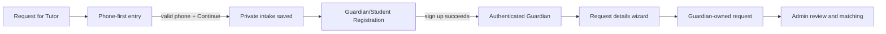

# Guardian/Student Registration এবং Request for Tutor — পরিকল্পনা

## 1. উৎস ও scope

এই নথিটি ব্যবহারকারীর সরবরাহকৃত `pasted_content.txt` এবং `pasted_content_2.txt` requirement থেকে প্রস্তুত। উভয় নথির reference URL হলো [যোগাযোগ-প্যানেল](https://prnt.sc/2GejA0PluyHH) এবং [mobile-first entry](https://prnt.sc/Vd0i_TSylngz)। Reference image সরাসরি screenshot/HTML হিসেবে ব্যবহার করা হবে না; semantic React, TypeScript ও Tailwind UI দিয়ে একই ধরনের visual hierarchy তৈরি হবে।

লক্ষ্য journey হলো:

এটি বিদ্যমান তিন-ধাপের `TutorRequest` form-কে বাতিল করবে না। বরং Guardian-এর phone-first intake ও registration সম্পন্ন হওয়ার পরে authenticated request form-এ প্রবেশ করাবে।

## 2. বর্তমান প্রকল্প অডিট

| বর্তমান অংশ | বর্তমান অবস্থা | নতুন journey-তে প্রয়োজনীয় পরিবর্তন |
|---|---|---|
| `/request-tutor` | তিন-ধাপের request form; final submit-এ Guardian session প্রয়োজন | public phone-first screen, registration handoff এবং return-to-request state যোগ হবে |
| `users` | role, email, password hash ও status আছে | Guardian password registration-এর জন্য safe create/duplicate path দরকার |
| `tutor_requests` | Guardian owner, unstructured `locationText`, basic status আছে | registration-intake link, structured location এবং future matching lifecycle আলাদা migration-এ যোগ হবে |
| Locations catalog | Bangladesh city → lower hierarchy seed করা আছে; Tutor endpoint protected | registration-এর জন্য সীমিত, safe public city/location search contract দরকার |
| Auth page | Guardian/Tutor role বেছে OAuth portal-এ যায় | Guardian-এর explicit email/password registration design-এর সঙ্গে reconciliation দরকার |
| Tutor request panel | এখনো planning stage; tutor dashboard-এ placeholder | Guardian flow সম্পন্ন হলে existing Manual matching plan-এর input হবে |

## 3. অনুমোদিত UI কাঠামোর প্রস্তাব

### 3.1 Step A — Request for Tutor entry page

ডেস্কটপে দুই কলামের layout থাকবে এবং mobile-এ এক কলাম হবে। বাম অংশে Admin-এর call, WhatsApp এবং platform message action থাকবে। `Call` হবে `tel:` link, WhatsApp হবে বর্তমান business number-এর `wa.me` link। Platform message-এ এখনো messaging feature না থাকায় এটি শুধু তখনই সক্রিয় হবে যখন একটি small contact-message flow অনুমোদিত হবে; অন্যথায় dead button রাখা হবে না।

ডান অংশে থাকবে একটি focused phone capture card: Bangladesh prefix `+880` fixed, 10-digit local number input, privacy note, validation, Continue button এবং login link। Continue সফল হলে button loading lock হবে, server intake record তৈরি/আপডেট করবে, এবং একটি short-lived httpOnly handoff cookie বা opaque server token দিয়ে registration page-এ যাবে। Phone number browser storage-এ রাখা হবে না।

### 3.2 Step B — Guardian/Student Registration panel

Page title হবে **Register as a Guardian/Student** এবং subtitle হবে **Sign Up to Continue**। Very light blue/gray background-এর ওপর সর্বোচ্চ প্রায় 720px চওড়া white card থাকবে। Desktop-এ two-column grid; tablet ও mobile-এ single-column grid।

| Field | Rule | Source / behaviour |
|---|---|---|
| Name | required, trimmed, 2–160 characters | text input |
| Gender | required | accessible radio group: Male / Female |
| Phone Number | required, Bangladesh canonical format | intake থেকে pre-filled; editable হলে re-validate + re-link |
| Email | required, valid, unique | server duplicate check; raw email client error-এ ফেরত নয় |
| City | required | Bangladesh city catalog search/select |
| Location | required | selected city-এর child hierarchy; searchable; City বদলালে reset |
| Password | required | password field; show/hide toggle; never persisted client-side |
| Confirm Password | required, password match | inline Zod error |
| Terms & Privacy | required true | clickable policy links; version/accepted-at server-side audit |

প্রতিটি required label-এ red asterisk, visible focus ring, `aria-invalid`, `aria-describedby`, error text, keyboard access এবং form-level recovery message থাকবে। Submit চলাকালে duplicate click বন্ধ থাকবে; success screen Guardian account তৈরির নিশ্চিতকরণ দিয়ে Request details step-এ যাবে। API failure হলে Bangla-friendly recovery text ও retry থাকবে।

### 3.3 Step C — authenticated request detail form

Registration সফল হলে Guardian existing request wizard-এ ফিরে যাবেন। Request payload-এ subject, class/course, tuition type, days/week, preferred tutor gender, monthly budget এবং structured Bangladesh location থাকবে। Account profile থেকে name/phone/email পুনরায় চাওয়া হবে না। Guardian dashboard-এর My Requests area পরে নিজের status ও cancel action দেখাবে।

## 4. Data model ও migration plan

Migration হবে **additive**; existing Tutor, Guardian এবং request record নষ্ট বা overwrite করা হবে না।

| Entity | গুরুত্বপূর্ণ field | কারণ |
|---|---|---|
| `guardian_registration_intakes` (নতুন) | random public-safe ID, canonical phone, `phoneCapturedAt`, `status`, nullable `guardianUserId`, expiry/updated timestamps | request-এর আগে phone নিরাপদে সংরক্ষণ এবং registration handoff |
| `guardian_profiles` (নতুন) | `userId` unique, gender, city ID, location ID, terms version, terms accepted-at, phone verified-at nullable | Guardian-only profile data `users` table থেকে আলাদা রাখা |
| `users` (extend only if necessary) | existing role/email/passwordHash/status reuse | password hash Tutor-এর মতো server-side only থাকবে |
| `tutor_requests` (future additive update) | structured location ID, optional intake/profile relation, status audit timestamps | existing `locationText` backward compatibility-তে থাকবে |
| `tutor_request_offers`, `tutor_request_activity` (পরের matching phase) | prior plan অনুযায়ী | manual matching ও audit trail |

Phone-এর জন্য canonical representation `+8801XXXXXXXXX` ব্যবহার হবে। Database unique rule শুধু registration complete হওয়া Guardian phone/email-এর জন্য প্রযোজ্য হবে; unverified intake phone একই ব্যক্তি পুনরায় দিলে server একই pending intake reuse করবে। Intake table public listing/API-তে কখনো ফেরত যাবে না।

## 5. Authentication, duplicate ও privacy নীতি

1. Guardian registration user-এর চাওয়া email/password credentials দিয়েই তৈরি হবে; password `scrypt` hash হিসেবে server-side store হবে এবং cleartext log, response, cache বা browser storage-এ থাকবে না।
2. Existing phone অথবা email পাওয়া গেলে endpoint generic account-enumeration-safe message দেবে; authenticated recovery/sign-in flow-এ identity অনুযায়ী স্পষ্ট recovery নির্দেশ দেখাবে। UI duplicate error আলাদা বুঝতে পারবে, কিন্তু অন্য account-এর existence leak করবে না।
3. Phone-first capture **authentication নয়**। OTP না থাকলে `phoneVerifiedAt` null থাকবে এবং Admin/Tutor contact reveal বা high-trust action তার ওপর নির্ভর করবে না।
4. Guardian-এর name, phone, email, precise location, intake status এবং terms acceptance শুধু Guardian owner ও Admin-এর protected API-তে থাকবে। Tutor inbox, public listing ও safe request DTO-তে এগুলো থাকবে না।
5. `city` এবং `location` catalog query শুধু active Bangladesh hierarchy record ফেরত দেবে। এটি public হলে শুধু ID/label/type/parent relationship ফেরত দেবে—কোনো user/request data নয়।
6. Terms acceptance-এর ক্ষেত্রে policy version ও timestamp রাখা হবে; Terms/Privacy page-এর final copy launch-এর আগে Owner approval প্রয়োজন।

## 6. TypeScript, form ও API design

React Hook Form + Zod resolver ব্যবহার হবে। Zod schemas shared server module-এ থাকবে; client inferred input type ব্যবহার করবে, duplicate hand-written form type নয়। Reusable `FormField`, `PasswordField`, `GenderRadioGroup`, `CatalogSearchField`, `FormErrorSummary` component থাকবে। Existing `CatalogSearchField` reuse করা হবে যেখানে আচরণ উপযুক্ত।

| API | Access | কাজ |
|---|---|---|
| `guardianIntake.capturePhone` | public, rate-limited | canonical phone validate; idempotent pending intake; handoff issue |
| `guardianAuth.register` | public, handoff-bound | Guardian user + profile create; terms log; session issue |
| `guardianAuth.login` | public | password verify; Guardian-only session outcome |
| `guardianProfile.getMine/updateMine` | guardian owner | own profile read/update |
| `guardianCatalog.searchCities/searchLocations` | public safe catalog | active Bangladesh city and city-descendant lookup |
| `guardianRequests.create` | authenticated Guardian | structured request create; ownership assignment |

সব create flow transaction-এ চলবে, যাতে user/profile/intake link আংশিক অবস্থায় না থাকে। Rate limit server-side হবে এবং `capturePhone`/registration duplicate submit idempotency key বা short request lock ব্যবহার করবে।

## 7. Test-first implementation order

| Ticket | প্রথমে যে tests লিখতে হবে | কাজ শেষের শর্ত |
|---|---|---|
| GR-01 | phone normalization, invalid Bangladesh phone, idempotent pending capture | intake schema + migration + capture API |
| GR-02 | user/profile transaction rollback, duplicate email/phone, password never returned | Guardian registration service + session |
| GR-03 | City change resets Location, keyboard form navigation, error association | reusable field components + responsive registration UI |
| GR-04 | unauthenticated/other-Guardian ownership denial, no contact leak | profile and request ownership APIs |
| GR-05 | request handoff after registration, loading/error/retry/success UI | complete Request for Tutor journey |
| GR-06 | 375px no overflow, 768px single-column, desktop two-column | screenshot + rendered responsive regression |
| GR-07 | policy/phone/privacy deny-list checks | release privacy review |

প্রতিটি ticket শেষে `pnpm vitest run`, `pnpm check`, `pnpm build`, `git diff --check` এবং focused code review চলবে। Migration schema-first হবে: schema edit → generated SQL inspection → single reviewed DB application → read-only verification → seed/catalog tests।

## 8. বাস্তবায়নের আগে চারটি সিদ্ধান্ত প্রয়োজন

| সিদ্ধান্ত | বিকল্প | প্রস্তাবিত default |
|---|---|---|
| Guardian account | `P` email/password এখনই, `O` শুধু existing OAuth | **P** — user-এর password field requirement পূরণ হবে |
| Phone verification | `N` এখন শুধু capture, `OTP` SMS OTP প্রথম release-এ | **N** — phone unverified হিসেবে থাকবে; OTP পরে নিরাপদে যোগ করা যাবে |
| Platform message | `F` simple contact form, `X` আপাতত call/WhatsApp শুধু | **X** — dead UI নয়; message feature আলাদা scope-এ |
| Terms pages | `D` draft in-app policy, `C` আপনি আগে final copy দেবেন | **D** — draft page তৈরি, launch-এর আগে approval দরকার |

Matching-এর পূর্বের সিদ্ধান্তও এই flow-এর সঙ্গে যুক্ত থাকবে: শুরুতে **Manual matching**, Telegram/Email/WhatsApp alert channel এবং contact reveal policy আলাদাভাবে অনুমোদন করতে হবে।

## 9. Recommendation

প্রথম release-এর জন্য **`P, N, X, D`** সুপারিশ করা হচ্ছে: Guardian email/password account, phone-first capture কিন্তু SMS OTP ছাড়া, Call/WhatsApp only contact actions, এবং clearly labelled draft Terms/Privacy page। এরপর Guardian request সম্পন্ন হলেই prior Manual matching workflow শুরু হবে।

> এই নথিটি পরিকল্পনা; কোনো production code, migration বা authentication behaviour এখনো পরিবর্তন করা হয়নি।
