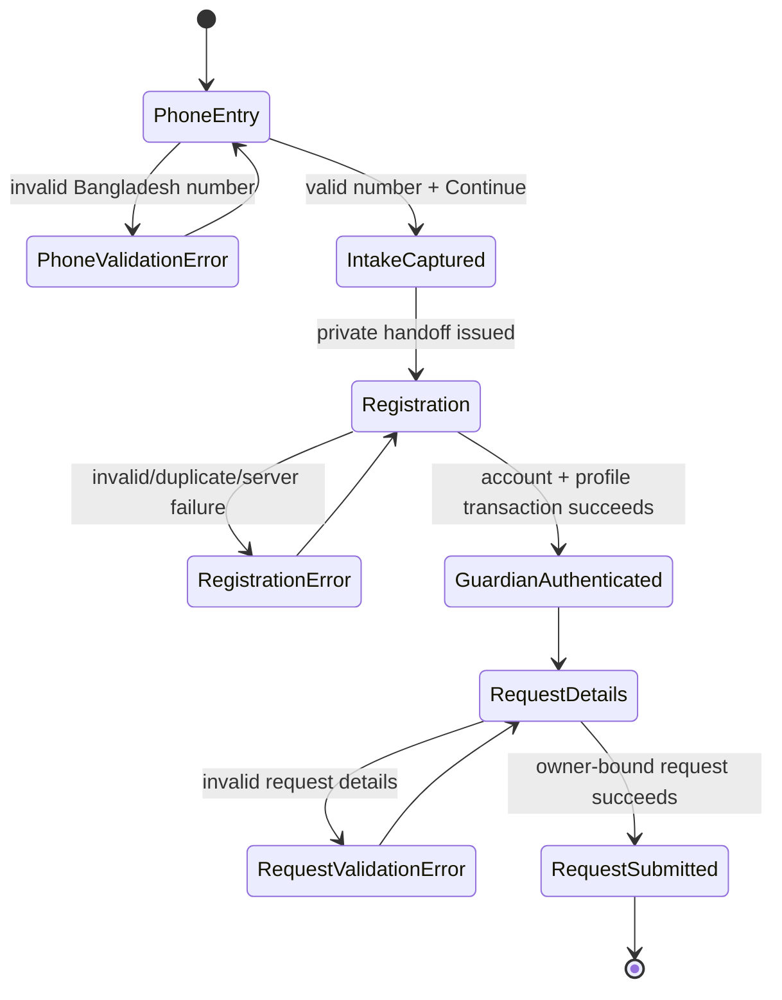

# Guardian/Student Registration ও Request for Tutor — Technical Specification

**Status:** Approval required before implementation  
**Approved product choices:** `P, N, X, D`  
**Stack:** React 19, TypeScript, Tailwind CSS 4, tRPC, Drizzle ORM, MySQL, Vitest

## 1. Scope and non-goals

এই release-এ public `/request-tutor` route-কে তিনটি connected state-এ সাজানো হবে: phone-first entry, Guardian/Student registration, এবং authenticated request-details completion। Guardian account হবে email/password ভিত্তিক; phone-first capture authentication বা verification হিসেবে বিবেচিত হবে না। Call এবং WhatsApp contact action থাকবে, কিন্তু in-platform messaging feature থাকবে না। Terms of Use ও Privacy Policy-এর draft page থাকবে, যার copy launch-এর আগে Owner review সাপেক্ষ।

এই release-এ SMS OTP, automated Tutor matching, Tutor-side request inbox, contact reveal, payment, platform messaging, অথবা Terms/Privacy-এর legal-final copy অন্তর্ভুক্ত নয়। Existing Tutor profile, Tutor location hierarchy এবং public Tutor discovery এই পরিবর্তনে সংশোধিত হবে না।

## 2. Personas and permission boundary

| Persona | Allowed actions | Explicitly denied actions |
|---|---|---|
| Anonymous visitor | phone-first intake capture; city/location catalog read; registration; public Call/WhatsApp action | existing Guardian data, requests, contact records, intake status list |
| Pending registrant | own short-lived handoff completion only | another phone intake claim; request creation before account creation |
| Authenticated Guardian | own profile and own Tutor Request create/read/update/cancel within permitted state | another Guardian’s data; Tutor private data; assignment/contact reveal |
| Tutor | no Guardian intake/profile read; no request contact data | request inbox and matching actions in this release |
| Admin | existing protected administrative access only; future matching work will add a dedicated request management API | no public exposure of Guardian data |

> Guardian name, canonical phone, email, exact location, consent metadata and intake state are private data. They must never appear in public Tutor listing responses, Tutor-facing DTOs, browser local storage, URL query strings, logs, or error strings.

## 3. User journey and state machine

The registration page is not a public profile directory. It may display a prefilled masked/canonical phone bound to the server-side intake. A changed phone creates or resumes a separate safe intake only after server validation; the browser does not choose an intake identifier.

## 4. Data model and migration contract

All database changes are additive and schema-first. Existing `users`, Guardian/Tutor records, Tutor Profile entries and existing `tutor_requests.locationText` are preserved. MySQL DDL will be inspected before a single reviewed apply operation; no destructive migration is permitted.

### 4.1 New `guardian_registration_intakes`

| Field | Type/constraint | Classification | Purpose |
|---|---|---|---|
| `id` | UUID/opaque non-sequential primary key | system-generated | server-only handoff identity |
| `phone` | canonical `+8801XXXXXXXXX`, indexed | user-entered private | captured before full registration |
| `status` | `pending`, `completed`, `expired` | system-generated | lifecycle control |
| `guardianUserId` | nullable FK to `users`, unique after completion | system-generated | links completed account |
| `expiresAt` | timestamp | system-generated | pending intake retention boundary |
| `createdAt`, `updatedAt` | timestamps | system-generated | audit/control |

There will be a partial/compound uniqueness strategy that permits repeated submission of the same *pending* phone to resume a single pending intake, but prevents a completed Guardian account from silently claiming another account’s phone. MySQL does not support generic partial indexes, so this exact rule will be implemented with a reviewed status-aware transaction and a safe unique constraint compatible with the final schema.

### 4.2 New `guardian_profiles`

| Field | Type/constraint | Classification | Purpose |
|---|---|---|---|
| `id` | primary key | system-generated | profile identity |
| `userId` | unique FK to `users` | system-generated | Guardian ownership |
| `gender` | `male` / `female` | user-entered private | approved registration field |
| `cityLocationId` | FK to active `locations` city | user-entered private | selected city |
| `locationId` | FK to active child `locations` record | user-entered private | selected area/location |
| `termsVersion` | text | system-generated | policy version accepted |
| `termsAcceptedAt` | timestamp | system-generated | consent audit |
| `phoneVerifiedAt` | nullable timestamp | system-generated | deliberately null in `N` release |
| `createdAt`, `updatedAt` | timestamps | system-generated | audit/control |

### 4.3 Existing `users` and `tutor_requests`

The existing `users` identity, role and server-only password hash fields will be reused. Guardian registration will create a `role = guardian` user only. A follow-up migration in this release may add nullable `guardianProfileId` and `guardianIntakeId` to `tutor_requests` only where the current schema requires an explicit reliable relation; existing requests remain valid if either field is null. `locationText` remains as a legacy compatible field, while the new structured location ID is used by the new journey.

## 5. Validation and canonical values

### 5.1 Shared validation rules

Zod schemas live in a shared feature module with inferred TypeScript types. Client validation improves recovery but server validation is authoritative.

| Input | Client and server rule | Error/recovery |
|---|---|---|
| Phone | local digits normalize to `+8801XXXXXXXXX`; exactly Bangladesh mobile prefix and 10 local digits | Bengali inline message; Continue remains enabled after correction |
| Name | trimmed, 2–160 visible characters | required Bengali error |
| Gender | exactly `male` or `female` | required radio group error |
| Email | normalized valid email, max safe length | generic duplicate-safe error; no account enumeration leak |
| City | active Bangladesh `city` record | search/select required |
| Location | active Bangladesh descendant record of selected City | resets when City changes; parent chain verified server-side |
| Password | existing secure minimum policy plus maximum safe length | show/hide only changes display, never persistence |
| Confirm password | exact password match | inline mismatch error |
| Terms | literal true | submission blocked with checkbox error |

### 5.2 Derived and system-generated values

`phone`, `cityLocationId`, `locationId`, profile ownership, intake status, expiry, terms version, accepted timestamp, session cookie and password hash must be generated/validated server-side. The client cannot set `userId`, `guardianUserId`, `phoneVerifiedAt`, `termsAcceptedAt`, terms version, request owner or protected status.

## 6. tRPC API contracts

Procedures remain tRPC-first. Router-level Zod input validation and role procedures enforce all access rules.

| Procedure | Guard | Input (summary) | Output (safe summary) | Behaviour |
|---|---|---|---|---|
| `guardianIntake.capturePhone` | public + rate limited | local phone digits | `{ next: 'register' }` | normalize, idempotently create/resume pending intake, set signed httpOnly short-lived handoff cookie |
| `guardianAuth.register` | public, valid handoff required | name, gender, email, city/location IDs, password, confirm password excluded after client validation, terms true | `{ user: safe Guardian session shape, next: 'request-details' }` | transaction: duplicate handling, user/profile creation, intake completion, session issuance |
| `guardianAuth.signIn` | public | email, password | safe session result | role must be Guardian; existing auth policy reused or safely extended |
| `guardianProfile.me` | Guardian only | none | own safe profile data | excludes password hash, internal intake data and other users |
| `guardianCatalog.searchCities` | public | query, limit | active `{ id,label,type }[]` | catalog only; no requests/users |
| `guardianCatalog.searchLocations` | public | `cityId`, query, limit, optional IDs hydration | active `{ id,label,type,parentId }[]` | child/descendant parent chain limited to city |
| `guardianRequests.create` | Guardian only | existing request fields + structured location ID | owner-safe request summary | binds `guardianId` from session; never accepts it from client |

Duplicate email/phone responses use allowlisted machine codes consumed by the UI. UI wording must not expose whether a named email/phone belongs to another person; a signed-in owner can receive clear profile-specific recovery guidance.

## 7. Interface specification

### 7.1 Public Request for Tutor entry

At `375px`, all content is one column with no horizontal scroll. At `768px`, the contact section and entry section may stack if necessary. At desktop, two columns are visible: a contact panel on the left and phone capture card on the right. The fixed `+880` prefix is visually and semantically separate from the local digits input. Call uses the approved Admin `tel:` number; WhatsApp uses its `wa.me` link. No “platform message” button appears in this release.

### 7.2 Registration panel

The registration route title is **Register as a Guardian/Student** and subtitle is **Sign Up to Continue**. It uses a light blue-gray page background and centered white card capped near 720px. Desktop uses a two-column field grid; tablet/mobile use one column. Every input has an explicit label, required asterisk, error region, visible focus, keyboard access, and `aria-invalid` only when invalid. The password visibility control has a descriptive accessible name.

Submit has distinct idle, submitting, success, duplicate-recovery and generic failure states. While submitting it is disabled and describes progress. Success routes into request details with an accessible success announcement. Error retry retains non-secret, safe form values but never writes password, confirmation password or raw phone/intake token to client persistence.

### 7.3 Request details handoff

After registration, the existing request-detail flow displays the stored Guardian identity context without exposing a way to alter owner ID. It uses the same structured City/Location catalog. Public contact values are not rendered in any Tutor-facing component. If a valid Guardian session already exists, `/request-tutor` bypasses phone-first capture and goes to the request detail flow; if a pending valid handoff exists, it resumes registration.

### 7.4 Terms and Privacy

`/terms` and `/privacy` will have clearly labelled **Draft** content, version identifier, effective-state wording and links back to registration. Checkbox consent records the current draft version. They are not presented as final legal advice or legal text.

## 8. Accessibility and responsive acceptance criteria

| Scenario | Observable criterion |
|---|---|
| Keyboard form completion | Tab sequence reaches every field, visibility control, consent link, submit and sign-in route without a keyboard trap |
| Invalid input | error has visible text, input `aria-invalid=true`, and error association; first invalid field receives focus on submit |
| Password | show/hide control uses an accessible descriptive name and does not clear entered value |
| City change | previously selected incompatible Location is cleared and a Bengali announcement explains why |
| 375px | no horizontal overflow; inputs and action buttons fit viewport and labels remain readable |
| 768px | card width, grid and control rows remain balanced; no collision or clipped copy |
| Desktop | max card width about 720px; registration fields use two columns except full-width consent/submission regions |

## 9. Security and retention controls

Intake capture and registration receive server-side rate limiting. Handoff uses a signed, httpOnly, secure, `SameSite` cookie or a server-side opaque token; raw intake IDs are not exposed to the client route. Passwords use the project’s existing scrypt strategy and no password/secret field is returned from any procedure. Error formatter exposes only safe field identifiers/codes, not SQL, raw messages or private values.

Pending intakes will be marked expired after a bounded retention period agreed in the schema implementation; the proposed default is **30 days**, which will be stored as an application retention constant and not accepted from the browser. This retention default is an implementation detail, not phone verification. Completed account phone is retained only under the account/profile policy. Request data privacy rules from the existing application remain in force.

## 10. Ticket order and test requirements

| ID | Deliverable | Required red-phase tests |
|---|---|---|
| GR-01 | Guardian intake schema and phone capture API | normalization; invalid numbers; idempotent pending capture; no phone in public outputs |
| GR-02 | Guardian user/profile registration transaction | duplicate recovery code; rollback; password absent from output; required consent audit |
| GR-03 | Public catalog access scoped to Bangladesh City/Location | only active records; location belongs to selected City; no user/request fields |
| GR-04 | Phone-first entry UI and contact actions | prefix validation; loading/error/retry; no platform-message action; responsive no-overflow |
| GR-05 | Guardian registration form UI | Zod field errors; password match; city reset; keyboard/error semantics; duplicate UI wording |
| GR-06 | Authenticated request handoff | registration success session; owner-bound request; cross-Guardian denial; safe return state |
| GR-07 | Draft policy pages and release review | versioned consent; policy links; privacy deny-list; responsive screenshots |

Every ticket is implemented TDD-first and finishes with focused Vitest tests. The complete release requires `pnpm vitest run`, `pnpm check`, `pnpm build`, `git diff --check`, schema/DB read-only verification, desktop/mobile screenshots and code review before checkpointing.

## 11. Approval requested

Approval of this specification authorizes the next step: create implementation tickets and then write production code. The approval phrase may be: **`Guardian registration specification approved`**.

## References

[1]: https://prnt.sc/2GejA0PluyHH "Supplied contact-panel visual reference"
[2]: https://prnt.sc/Vd0i_TSylngz "Supplied phone-entry visual reference"
