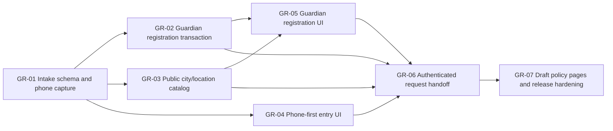

# Guardian/Student Registration ও Request for Tutor — Implementation Tickets

**Source specification:** `docs/guardian-registration-request-spec.md`  
**Approved product decisions:** `P, N, X, D`  
**Execution rule:** Each ticket begins with focused red-phase Vitest coverage, keeps Guardian data private, and is independently reviewable before the next ticket begins.

## Dependency map

## GR-01 — Guardian intake schema and private phone capture

| Item | Definition |
|---|---|
| **Purpose** | Create an additive, private phone-intake lifecycle that captures a Bangladesh number before registration without treating capture as authentication or verification. |
| **Likely surfaces** | `drizzle/schema.ts`, generated reviewed migration, `server/db.ts`, `server/routers.ts`, a new Guardian feature validation module, router/database tests. |
| **Dependencies** | None. |
| **Key constraints** | Canonical form is `+8801XXXXXXXXX`; no raw intake ID reaches route state, local storage, query strings, logs, or response payloads. The handoff must be signed and httpOnly. Pending repeats resume safely; a completed Guardian phone cannot be claimed by another account. `phoneVerifiedAt` remains null. |
| **Red-phase tests** | Normalization and invalid prefix/length rejection; a repeat pending capture is idempotent; resulting public output excludes phone and intake metadata; expired handoff is denied; all unsafe duplicate/internal errors map to safe codes. |
| **Acceptance criteria** | Reviewed additive DDL is applied; the public capture procedure creates or resumes only a pending private intake and emits a short-lived server-managed handoff. No existing Tutor or request behaviour changes. |
| **Verification** | Focused Vitest; migration SQL inspection; read-only schema check; `pnpm check`. |

## GR-02 — Guardian account/profile registration transaction

| Item | Definition |
|---|---|
| **Purpose** | Create Guardian users and private Guardian profiles only from a valid intake handoff, recording approved consent and safely completing the intake in one transaction. |
| **Likely surfaces** | Schema/migration if needed, Guardian validation contract, auth/database helpers, `server/routers.ts`, protected session/auth tests. |
| **Dependencies** | GR-01. |
| **Key constraints** | Reuse scrypt password handling; create `role = guardian` only; store name, gender, city/location relation and terms version/timestamp privately; never return password/hash, raw intake metadata, or account-enumeration details. |
| **Red-phase tests** | Valid registration succeeds with a safe Guardian session shape; invalid/missing consent fails; wrong location parent chain fails; duplicate email/phone produces allowlisted generic recovery code; injected persistence failure rolls back user/profile/intake completion. |
| **Acceptance criteria** | A valid handoff produces exactly one Guardian user/profile and completed intake; retry is safe; a valid Guardian session is established; other roles cannot use Guardian-only profile endpoints. |
| **Verification** | Focused and full Vitest; TypeScript; transaction/error-path review. |

## GR-03 — Public Bangladesh City → Location catalog boundary

| Item | Definition |
|---|---|
| **Purpose** | Supply the city and child-location lookups required by the Guardian form without exposing users, Guardian records, Tutor requests, or non-Bangladesh catalog scope. |
| **Likely surfaces** | `server/db.ts`, `server/routers.ts`, catalog tests and typed shared input/output contracts. |
| **Dependencies** | Existing Bangladesh location hierarchy. |
| **Key constraints** | City results are active Bangladesh `city` records; location results are active descendants of the selected city; optional IDs only hydrate the caller's selected catalog labels. Outputs contain only `{ id, label, type, parentId }` as required. |
| **Red-phase tests** | Inactive/non-Bangladesh records excluded; an unrelated city cannot retrieve another city's location; selected IDs hydrate labels; output omit user/request/contact fields. |
| **Acceptance criteria** | The public procedure has bounded search/IDs inputs, deterministic parent scoping and no personal-data query path. |
| **Verification** | Router/helper regressions; read-only representative data query; `pnpm check`. |

## GR-04 — Public phone-first Request for Tutor entry

| Item | Definition |
|---|---|
| **Purpose** | Replace the initial public request action with the approved contact-panel plus phone-first entry experience. |
| **Likely surfaces** | `client/src/pages/TutorRequest.tsx`, focused UI helpers/tests, existing header/contact constants and styles. |
| **Dependencies** | GR-01. |
| **Key constraints** | Fixed semantic `+880` prefix; local number only is typed; Call and WhatsApp actions use existing approved links; no platform-message control; only safe local phone state exists until capture succeeds. |
| **Red-phase tests** | Invalid phone shows Bangla recovery and does not call mutation; pending state prevents duplicate submission; success advances to registration; the rendered surface has Call/WhatsApp but no platform-message action; 375px layout no-overflow contract. |
| **Acceptance criteria** | At 375px the entry is single-column and tappable; at desktop the contact and input panels form the specified two-column presentation; keyboard focus and error semantics remain usable. |
| **Verification** | Component regressions, 375px/768px/desktop screenshots, `pnpm check`. |

## GR-05 — Guardian/Student registration form

| Item | Definition |
|---|---|
| **Purpose** | Build the approved email/password registration form that consumes only a valid server-managed handoff and collects the private Guardian profile fields. |
| **Likely surfaces** | `client/src/pages/Auth.tsx` or a focused Guardian route/component, selector component reuse, form-data helpers, route wiring, component tests. |
| **Dependencies** | GR-02 and GR-03. |
| **Key constraints** | Full name, gender, email, City, Location, password, confirmation and consent are required; City change clears incompatible location with Bengali announcement; password values are never persisted client-side; duplicate feedback is generic. |
| **Red-phase tests** | Each required validation path; password confirmation mismatch; city-dependent location reset; safe duplicate recovery wording; show/hide retains value; focused first invalid control; keyboard completion. |
| **Acceptance criteria** | Desktop is a bounded two-column grid and mobile/tablet are one column; correct terms/privacy links appear; successful registration creates a session and advances to request details. |
| **Verification** | Component regressions; 375px/768px/desktop visual checks; `pnpm vitest run`; `pnpm check`. |

## GR-06 — Authenticated request-details handoff and ownership

| Item | Definition |
|---|---|
| **Purpose** | Complete the transition from public intake and Guardian registration into the existing Tutor Request workflow, binding all created requests to the authenticated Guardian. |
| **Likely surfaces** | `server/routers.ts`, `server/db.ts`, request schema/migration if explicit relation is absent, `TutorRequest.tsx`, request API/UI tests. |
| **Dependencies** | GR-02, GR-03, GR-04 and GR-05. |
| **Key constraints** | Ownership derives solely from session; an authenticated Guardian bypasses phone-first entry; incoming owner/intake IDs are ignored/rejected; existing anonymous/legacy requests stay compatible; no Guardian contact data enters Tutor/public DTOs. |
| **Red-phase tests** | Registration session creates a request owner-bound to that Guardian; cross-Guardian read/update/cancel is denied; invalid structured location fails; public/Tutor calls cannot see Guardian private fields; successful request routes to a safe confirmation state. |
| **Acceptance criteria** | New requests store owner relation and structured city/location where enabled; existing request behaviour remains intact; all object-level authorization checks occur server-side. |
| **Verification** | Protected router tests, component handoff regression, privacy DTO scan, database read-only verification. |

## GR-07 — Draft policy pages, final integration and release hardening

| Item | Definition |
|---|---|
| **Purpose** | Add versioned, explicitly draft Terms and Privacy pages, finalize contact links, and complete project-wide verification of the new journey. |
| **Likely surfaces** | New policy pages/routes, registration links, policy copy/constants, release-review documentation, tests. |
| **Dependencies** | GR-04 through GR-06. |
| **Key constraints** | Content is labelled Draft and not presented as final legal advice; consent stores the draft version; no platform messaging or OTP scope is introduced. |
| **Red-phase tests** | Both policy routes render Draft/version labels; registration links resolve; consent version is recorded; no Guardian data appears in public/Tutor response fixtures. |
| **Acceptance criteria** | The complete journey has safe success/error/recovery states, responsive evidence, and documented known deferrals: OTP, automatic matching, Tutor inbox, contact reveal, payment and final legal copy. |
| **Verification** | `pnpm vitest run`, `pnpm check`, `pnpm build`, `git diff --check`, DB read-only checks, desktop/mobile screenshots and `code-review` checklist. |

## Release gates

| Gate | Required result |
|---|---|
| Data safety | Additive migration inspected and applied once; no destructive DDL; existing Tutor and request records preserved. |
| Privacy | Guardian name, phone, email, exact location, consent and intake identifiers absent from public/Tutor DTOs, browser persistence and error text. |
| Authorization | Guardian ownership is session-derived; cross-Guardian access and all Tutor request-data access are denied. |
| Quality | All focused regressions plus `pnpm vitest run`, `pnpm check`, `pnpm build` and `git diff --check` pass. |
| UX | 375px, 768px and desktop checks show no overflow, visible errors/focus, reachable legal links and usable contact actions. |

## First implementation step

Start **GR-01** only. It is the smallest dependency-free foundation and must complete its focused TDD, migration safety and privacy checks before GR-02 begins.
