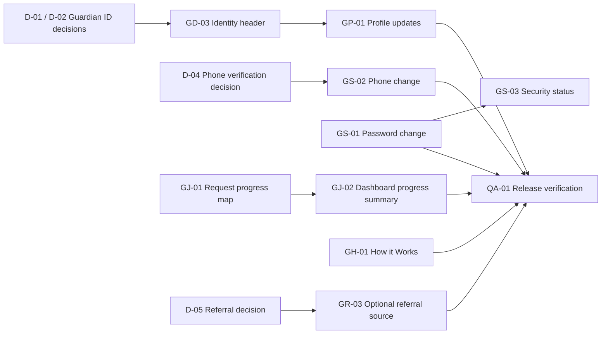

# Guardian Workspace Completion Release 1 — Implementation Tickets

**Status:** Proposed for approval; no feature implementation is authorized by this document alone.  
**Prepared:** 21 August 2026  
**Basis:** [Guardian Dashboard, Admin Moderation, and Job Board Critical Review](./guardian-admin-jobboard-grill-review.md)

## Purpose and release boundary

This ticket package completes the highest-priority Guardian self-service gaps without changing the already-validated Admin publication and public Job Board boundaries. It deliberately does **not** add public Tutor profiles, Guardian contact disclosure, exact-address maps, automatic matching, attendance records, confirmation-letter issuance, or interactive community features.

> **Release principle:** A Guardian can understand their account and request progress, make controlled changes to their own profile, and access clearly scoped security actions. Admin confirmation remains compulsory before a request becomes public.

| Included in Release 1 | Explicitly deferred |
|---|---|
| Guardian account identity header, initials/avatar fallback, real creation date, and Guardian ID after its format is approved | Student ID, unless its issuer, relationship to multiple students, and visibility rules are separately approved |
| Editable Guardian profile fields that do not change login ownership | Profile-photo upload until file-storage, deletion, moderation, and visibility policies are approved |
| Current-password-verified password change | Phone-number update until the re-verification method is approved |
| Truthful request-progress map in Dashboard and Posted Jobs | Attendance tracking, session calendars, percentages, payment status, or tutor timesheets |
| Static How it Works guidance and support route | Interactive community features, messaging, or promotional entitlement systems |
| Optional referral-source capture only after its purpose/retention policy is approved | Required marketing attribution or free-text tracking without a documented purpose |

## Approval gates

The implementation sequence begins only after the product owner records the following decisions. These are small choices, but they affect data design, privacy, and security.

| Gate | Decision required | Recommended option | Blocks |
|---|---|---|---|
| **D-01** | What identifier should appear in the Guardian header? | Display **Guardian ID** only; do not display Student ID in v1. | GD-03 |
| **D-02** | Guardian ID format and issuance moment | A stable support-facing ID, unique and distinct from the database primary key; issue it when the Guardian account is created. | GD-03 |
| **D-03** | Is photo upload required in this release? | No. Show initials/avatar fallback in Release 1; make upload a separately specified feature. | GD-03 scope |
| **D-04** | How is a changed phone number re-verified? | Do not activate a new number until a verified channel is approved and implemented. | GS-02 |
| **D-05** | Is referral-source data needed, and for which operational purpose? | Optional bounded choices on the final request step; no free text by default; no impact on matching. | GR-03 |
| **D-06** | Online-only tuition location rule | Permit no physical area for online-only requests; do not disclose any irrelevant location. | GR-03 / request refinements |

## Dependency map

The diagram does not indicate that every optional item is required. `GS-02` and `GR-03` remain unstarted unless their corresponding decision gate is approved.

## Ticket summary

| Order | Ticket | Outcome | Type | Dependency |
|---|---|---|---|---|
| 0 | D-01 to D-06 | Record the six product decisions above. | Product decision | None |
| 1 | GD-03 | Show a real Guardian identity header with an approved Guardian ID and safe avatar fallback. | Data + UI | D-01, D-02, D-03 |
| 2 | GP-01 | Allow Guardians to update approved non-login profile fields safely. | Data + API + UI | GD-03 |
| 3 | GS-01 | Add a current-password-protected password-change flow. | API + UI + security | None |
| 4 | GS-02 | Add a re-verified phone-number change flow. | Data + API + UI + security | D-04 |
| 5 | GJ-01 | Define authoritative Guardian-facing request-progress states. | Contract + API | Existing request/publication lifecycle |
| 6 | GJ-02 | Surface progress consistently on Dashboard and Posted Jobs. | UI | GJ-01 |
| 7 | GH-01 | Add a truthful static How it Works page in the dashboard. | UI + content | Approved wording |
| 8 | GR-03 | Capture optional referral source without affecting eligibility. | Schema + API + UI | D-05, D-06 |
| 9 | QA-01 | Run release-level security, regression, accessibility, and responsive verification. | Validation | All approved tickets |

---

## D-01 to D-06 — Product decisions and release authorization

### Purpose

Record the choices that the implementation cannot safely infer from reference images. This ticket contains no code and does not change production data.

### Required decisions

| Code | Approval text to record | Recommended default |
|---|---|---|
| D-01 | “Use Guardian ID only in the v1 header; no Student ID.” | Approve |
| D-02 | “Issue one unique Guardian ID at account creation; format: ____.” | Choose a support-facing, non-sensitive format |
| D-03 | “Use initials/avatar fallback in Release 1; photo upload is deferred.” | Approve |
| D-04 | “New phone numbers are activated only after ____ verification.” | Choose a real verified method, not a visual-only confirmation |
| D-05 | “Referral source is optional / not included in this release.” | Optional bounded list |
| D-06 | “Online-only requests require / do not require physical location.” | Do not require a physical location |

### Acceptance criteria

The chosen values are written into the approved specification or ticket comments before a migration or user-facing copy is drafted. Any unapproved item remains excluded rather than receiving a fabricated default.

---

## GD-03 — Guardian identity foundation and sidebar header

### Purpose

Replace the generic Guardian dashboard account presentation with the requested role-specific header: brand/logo, identity-safe avatar fallback, Guardian name, email, Guardian ID, and true profile creation date.

### Scope

The ticket includes a full-width identity section at the top of the Guardian sidebar and a compact responsive version for mobile. It uses a deterministic initials/avatar fallback. It does not include Student ID, photo upload, public profile cards, or any information that leaves the Guardian-only dashboard.

### Likely surfaces

| Surface | Expected change |
|---|---|
| `drizzle/schema.ts` and migration | Add Guardian ID only if the existing account model lacks a stable non-primary-key identifier. Reuse the authoritative user creation timestamp; do not duplicate it. |
| `server/db.ts` | Add an owner-only Guardian identity reader/initializer. |
| `server/routers.ts` | Add or extend a Guardian-protected identity procedure with a minimal DTO. |
| `client/src/pages/GuardianDashboard.tsx` | Consume the identity DTO and render the dedicated header. |
| Shared dashboard component, if used | Preserve Tutor/Admin presentation; add Guardian-specific composition instead of leaking role fields. |
| Tests | Add deterministic ID issuance, authorization, date formatting, and responsive rendered checks. |

### Data and authorization contract

The returned DTO should contain only `displayName`, `email`, `guardianId`, `createdAt`, and avatar-fallback metadata. It must be returned only to the authenticated Guardian who owns the account. The route must never include a student name, an internal database key, a private request note, a phone number not needed in the header, or public Job Board content.

### Acceptance criteria

| Criterion | Testable result |
|---|---|
| Guardian identity | A signed-in Guardian sees their real name/email, approved Guardian ID, and account creation date. |
| Role separation | Tutor and Admin dashboards do not inherit Guardian-only fields or navigation. |
| Student ID safety | No Student ID label/value renders in Release 1. |
| Avatar safety | Initials/fallback render without file upload; no storage key or private image URL is exposed. |
| Mobile usability | Identity details wrap without clipping at 375 px and are keyboard-accessible. |
| Data integrity | Guardian ID is unique, stable after profile edits, and never based on a public request or student record. |

### Verification

Run focused server and DOM tests, `pnpm test`, `pnpm exec tsc --noEmit`, `pnpm build`, and capture desktop/mobile dashboard screenshots under an authenticated Guardian session.

### Risks and rejected alternatives

Do not use the numeric database primary key as a displayed Guardian ID. Do not synthesize a Student ID. Do not bundle image upload into this ticket, because storage authorization and lifecycle rules are a separate security boundary.

---

## GP-01 — Controlled Guardian profile updates

### Purpose

Turn the current Guardian Profile tab from a read-only summary into an owner-controlled profile-update workflow for approved non-login fields.

### Scope

Release 1 supports changes to the Guardian’s display name and saved contact-preference/location information that is already used privately by the account. Email and phone are excluded; phone belongs to `GS-02`, and email changes require a separate ownership-verification design.

### Likely surfaces

| Surface | Expected change |
|---|---|
| Schema/migration | Add only missing Guardian-owned profile attributes and audit metadata; do not copy sensitive request data into profile fields. |
| `server/db.ts` | Add ownership-bound update helper and privacy-safe audit summary. |
| `server/routers.ts` | Add `guardian.updateProfile` with explicit input allowlist and strict server validation. |
| `GuardianDashboard.tsx` or extracted profile panel | Edit, cancel, save, pending, success, and recoverable-error states. |
| Location selector components | Reuse canonical Bangladesh location data and validation; do not introduce a second location taxonomy. |
| Tests | Ownership denial, allowlisted payloads, invalid-location recovery, dirty-state protection, and rendered keyboard behavior. |

### Authorization and audit requirements

Every write is bound to `ctx.user.id` and must reject a payload that attempts to target another Guardian. Only allowlisted fields are accepted. An audit event may record which category changed and when, but must not snapshot addresses, mobile numbers, or free-text contents into broadly readable logs.

### Acceptance criteria

| Criterion | Testable result |
|---|---|
| Self-service edit | A Guardian can edit only the approved profile fields and sees field-level recovery guidance. |
| Ownership | A Guardian cannot read/update another account through IDs or modified request payloads. |
| Location integrity | Saved city/area values come from the canonical selector and remain private. |
| Job Board boundary | Profile changes do not modify an already-published job projection without the Admin moderation process. |
| Accessibility | Inputs have labels, error associations, focus recovery, and a mobile-safe save/cancel layout. |
| Audit safety | Audit records omit raw phone, exact address, and password material. |

### Verification

Use TDD-focused tRPC authorization tests and DOM tests before implementation. Complete full test/type/build validation and authenticated desktop/mobile visual verification after integration.

---

## GS-01 — Authenticated password change

### Purpose

Provide the requested Guardian Settings password change without claiming an automated email reset exists.

### Scope

The Settings tab presents a current password, new password, and confirmation field. The server verifies the existing password, applies the existing password-strength policy, stores only the new password hash, and returns a generic success/failure response. The support-assisted recovery route remains separate.

### Likely surfaces

| Surface | Expected change |
|---|---|
| Authentication helper/service | Reuse the established scrypt verification and hash creation path; do not create a second password implementation. |
| `server/routers.ts` | Add a Guardian/protected password-change procedure with rate-safe validation. |
| Database helper | Reuse or add a single ownership-bound credential update helper. |
| Guardian Settings panel | Add controlled form fields, strength/match indicators, pending state, and truthful support copy. |
| Security audit helper | Record a privacy-safe password-changed event without password content. |
| Tests | Wrong-current-password, weak/mismatched password, successful update, session behavior, and UI accessibility. |

### Security rules

The current password is required on every change. New and confirmation values are never included in logs, toast text, query caches, audit snapshots, or telemetry. The implementation should invalidate other sessions or rotate the current session according to the existing auth architecture; the selected behavior must be explicitly tested and communicated in the success message.

### Acceptance criteria

| Criterion | Testable result |
|---|---|
| Current-password challenge | An incorrect current password never changes the credential and returns no credential-specific server detail. |
| Strength and match | Weak and mismatched inputs fail predictably in the UI and on the server. |
| Success | The old password no longer authenticates; the new password does. |
| Session protection | The documented post-change session behavior occurs consistently. |
| Truthful recovery | The UI does not show an email-reset link unless that feature exists. |
| Security hygiene | Tests demonstrate no raw password appears in response bodies, audit data, or rendered confirmation text. |

### Verification

Run focused auth regression tests, full test/type/build validation, and keyboard/mobile verification for the Settings form.

---

## GS-02 — Verified phone-number change

### Purpose

Allow a Guardian to change the number Admin uses for confirmation calls while preventing accidental loss of a verified contact channel or account takeover.

### Prerequisite

**D-04 must be approved.** The current product decision does not establish an end-to-end Guardian phone-verification channel. This ticket cannot replace verification with a client-side checkbox or a mere “save” action.

### Scope options for approval

| Option | Flow | Suitability |
|---|---|---|
| A. SMS/OTP | Verify the new Bangladesh number using a time-limited code, then activate it. | Strongest self-service option; requires provider and operational setup. |
| B. Admin-assisted confirmation | Record a verified support/Admin confirmation before activation. | Works without an SMS provider; slower and must remain clearly labeled as pending. |
| C. No v1 phone changes | Keep current number immutable in self-service; support handles documented exceptions. | Safest until a verified channel is available. |

### Acceptance criteria

The currently active number remains usable until the new number passes the approved verification process. The new phone never appears on the public Job Board. Failed or expired verification cannot overwrite the active number. Every Guardian receives clear pending/success/recovery states, and Admin sees only the operational status required to coordinate confirmation.

### Verification

Add procedure-level tests for ownership, Bangladesh phone validation, verification expiry/replay (if applicable), and no-premature-activation. Test the rendered pending/verified/error states on desktop and mobile.

---

## GJ-01 — Authoritative Guardian request-progress contract

### Purpose

Define one truthful, Guardian-facing status map across a private request, Admin verification, Guardian confirmation call, Job Board publication, expiration, and final match/close outcomes.

### Scope

This is a contract/API ticket first. It should adapt existing authoritative fields such as request state, `guardianConfirmedAt`, publication state, published Job ID, expiry time, and matching outcome. It must not invent a new status that conflicts with the existing Admin lifecycle.

### Proposed display model

| Display status | Authoritative evidence | Guardian-facing explanation | Guardian action |
|---|---|---|---|
| Submitted | Request exists; Admin verification pending | “Your request has been received for coordinator review.” | Wait or contact support for correction. |
| Under review | Admin verification in progress | “We are reviewing the tutoring requirements.” | Wait. |
| Confirmation needed | Guardian confirmation not recorded after review/edit | “A coordinator will contact you before any public job is posted.” | Keep phone reachable; contact support if needed. |
| Ready to publish | Approval exists but no active job projection | “Your request is ready for the next coordination step.” | Wait. |
| Published | Active, unexpired projection with Job ID | “Your job is available to eligible Tutors; contact details remain private.” | View private Job ID/expiry only. |
| Expired / unpublished | Projection inactive or expired | “This job is no longer available to Tutors.” | Contact support if requirements continue. |
| Matching in progress | Admin-reviewed Tutor interest or internal matching record, if such a state exists | “A coordinator is reviewing potential Tutor matches.” | Wait; do not infer a match. |
| Tutor confirmed / closed | Authoritative matching/closure record exists | “Your request has reached its recorded outcome.” | Follow the future confirmation/attendance policy when available. |

The precise labels must be mapped only where authoritative fields exist. If the present schema lacks a matching outcome, the UI must stop at **Published** or **Expired/Unpublished** rather than infer “Matching in progress.”

### Likely surfaces

| Surface | Expected change |
|---|---|
| Contract module | Add a deterministic pure mapper from authoritative lifecycle fields to a display state. |
| Tests | Enumerate allowed state combinations, expired boundaries, confirmation dependencies, and impossible combinations. |
| `server/db.ts` / router DTO | Return only the fields needed for the owner’s status display. |
| Privacy review | Ensure no projection includes Guardian contact, exact address, student identity, or internal Admin notes. |

### Acceptance criteria

Every label has a server-evidenced source. A public Job Board listing alone cannot create a “Tutor confirmed” or Attendance state. A Guardian can see their own Job ID and expiry where applicable, while unauthenticated users and Tutors cannot query the same owner-specific progress data.

### Verification

Run pure contract tests plus tRPC ownership tests. Include edge cases for unconfirmed publication, republished jobs, expiry, and one-time extension after recorded reconfirmation.

---

## GJ-02 — Dashboard and Posted Jobs progress presentation

### Purpose

Use the GJ-01 contract to make the Guardian Dashboard’s most important information actionable: current request stage, what the coordinator is doing, and what the Guardian should do next.

### Scope

The Dashboard gets a compact “Request progress” module showing the most recent active request and a link to Posted Jobs. Posted Jobs receives a consistent status badge, short explanation, submission date, private Job ID/expiry when applicable, and a safe support route.

### Non-goals

This ticket does not permit a Guardian to self-publish, alter a published job, see Tutor personal details, access Admin notes, cancel a request automatically, or start attendance tracking.

### Acceptance criteria

| Criterion | Testable result |
|---|---|
| Consistency | The same request produces the same display label in Dashboard and Posted Jobs. |
| Truthfulness | Copy reflects the GJ-01 contract and does not promise a Tutor, timeline, or automatic matching. |
| Privacy | No raw Guardian contact, exact address, student identity, or Admin-only note appears. |
| Recovery | Each blocked/pending state provides an appropriate support or wait explanation. |
| Responsive UI | Cards remain legible, keyboard-reachable, and non-clipped at 375 px. |

### Verification

Add DOM tests for all supported display states and integration tests confirming that the owner-only data does not cross role boundaries. Capture authenticated Guardian desktop/mobile screenshots.

---

## GH-01 — Guardian How it Works page

### Purpose

Implement a clear, static explanation of the platform’s real coordination process so Guardians understand why publication is not instant and why their contact remains private.

### Content structure

| Step | Approved factual message |
|---|---|
| 1. Submit a request | “Tell us the learning need, location, schedule, and budget range.” |
| 2. Coordinator review | “A coordinator reviews requirements and may contact you for clarification.” |
| 3. Confirmation call | “We confirm changes with you before publishing an available tuition opportunity.” |
| 4. Tutor interest and matching | “Eligible Tutors may express interest; our team coordinates suitable matches.” |
| 5. Next steps | “We will contact you about the recorded outcome. Availability and timing are not guaranteed.” |

### Acceptance criteria

The page is accessible from the Guardian sidebar, has a clear support path, works at mobile widths, and contains no claim of guaranteed tutor availability, immediate publication, automatic matching, payment collection, attendance tracking, or public Guardian contacts.

### Verification

Add a rendered route/sidebar test for navigation and key factual copy, then include the page in responsive visual review.

---

## GR-03 — Optional referral-source capture

### Purpose

Capture optional non-sensitive attribution only if D-05 is approved, while preserving the Guardian tutor-request journey’s existing validation and draft/preview protections.

### Proposed data design

Store a bounded selection such as `facebook`, `google_search`, `friend_or_family`, `school_or_tutor`, `whatsapp`, `other`, or `prefer_not_to_say`. “Other” should remain a controlled choice unless a documented use case justifies free text. The field must not influence matching, public Job Board eligibility, Tutor visibility, or Admin publication approval.

### Placement

Show it as an optional question on the final request step or preview stage, immediately before submit. It must not block the first two stages and must continue to participate in private draft recovery only after its data-retention purpose is approved.

### Acceptance criteria

The field is optional, has a clear privacy-purpose note, reaches only the authorized Admin audience if retained, and never appears on a public/Tutor Job Board projection. Existing submits work unchanged for absent values.

### Verification

Add migration/default-value tests, request-schema validation tests, private draft/preview tests, and a projection regression that proves referral source is excluded from public jobs.

---

## QA-01 — Integrated release verification

### Purpose

Validate every approved ticket as a coherent Guardian workflow and prove that the existing Admin and Job Board protections have not regressed.

### Required checks

| Category | Required verification |
|---|---|
| Authorization | Guardian ownership for identity/profile/settings/progress reads and writes; Tutor/Admin role separation; Admin 2FA gates remain active. |
| Privacy | No Guardian phone/email/exact address/student identity/free notes/referral data appear in public jobs or Tutor views. |
| Lifecycle | Guardian confirmation is still required before publication; material edits clear confirmation; 14-day expiry and one reconfirmed extension hold. |
| Security | Password material absent from UI state, logs, audit events, and APIs; phone changes cannot activate early. |
| Tests | Focused new tests plus `pnpm test`, `pnpm exec tsc --noEmit`, and `pnpm build`. |
| Accessibility | Keyboard traversal, labelled fields, errors tied to controls, focus recovery, contrast, and non-clipped mobile actions. |
| Visual | Authenticated Guardian desktop and 375 px mobile review for sidebar header, Profile, Settings, Dashboard, Posted Jobs, and How it Works. |

### Release acceptance criteria

The release can be checkpointed only when all approved tickets are complete, every required test passes, no secret or sensitive data is in the diff, and a code review confirms public Job Board projections remain privacy-safe.

## Work intentionally not ticketed yet

| Deferred feature | Why it requires separate discovery/specification |
|---|---|
| Profile photo upload | Storage lifecycle, consent, delete/replace flow, file validation, and role visibility are unresolved. |
| Guardian Student ID | The system’s learner identity model, issuers, and multi-student relationship are unresolved. |
| Attendance | Requires matched-Tutor authority, scheduled sessions, timezone, correction/dispute, and payment/attendance semantics. |
| Confirmation letter | Requires eligibility, authoritative signatory, document template, and revocation policy. |
| Guardian community / Exclusively Yours | Requires membership, content/moderation, reporting, and consent policies. |
| Guardian self-service close request | Requires operational consequences, closing authority, and safe reversal/escalation policy. |

## Recommended approval message

> **Approve Release 1 core:** D-01 Guardian ID only, D-03 initials/avatar fallback, GD-03, GP-01, GS-01, GJ-01, GJ-02, GH-01, and QA-01.  
> **Hold pending decision:** GS-02 phone change and GR-03 referral source.  
> **Keep deferred:** Student ID, photo upload, Attendance, Confirmation Letter, community features, and close-request action.

Once the approval message is confirmed, implementation should begin with **GD-03** and proceed in the listed dependency order.
