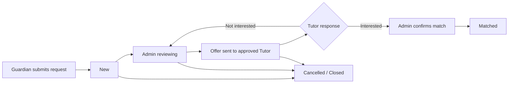

# Tutor Request Panel — বিস্তারিত বাস্তবায়ন পরিকল্পনা

## 1. উদ্দেশ্য ও প্রস্তাবিত প্রথম সংস্করণ

Tutor Request Panel-এর লক্ষ্য হলো Guardian-এর জমা দেওয়া tuition request-কে নিরাপদভাবে review, matching এবং Tutor response-এর মাধ্যমে পরিচালনা করা। প্রথম সংস্করণে **Manual matching** সবচেয়ে উপযুক্ত: Admin request যাচাই করে একজন বা একাধিক উপযুক্ত, approved Tutor-কে offer পাঠাবেন; Tutor আগ্রহী বা অনাগ্রহী উত্তর দেবেন; তারপর Admin দুই পক্ষের পরবর্তী যোগাযোগ সমন্বয় করবেন।

> এই প্রথম সংস্করণে Guardian বা Tutor-এর ব্যক্তিগত phone number ও email অন্য পক্ষকে সরাসরি দেখানো হবে না। যোগাযোগ প্রকাশের সিদ্ধান্ত Admin-এর নিয়ন্ত্রিত final-match ধাপে থাকবে।

## 2. বর্তমান সিস্টেম অডিট

| বর্তমান অংশ | ইতিমধ্যে আছে | Panel-এর জন্য প্রয়োজনীয় পরিবর্তন |
|---|---|---|
| Guardian request form | Guardian session-এ request তৈরি হয় | Structured location, request detail, status history ও cancellation যোগ হবে |
| `tutor_requests` | Tuition type, subject, budget, location text, optional Tutor ID এবং `new/reviewing/matched/closed` status আছে | Separate offer/assignment, audit log, richer state, indexes ও ownership rules লাগবে |
| Tutor dashboard | `/tutor/dashboard/requests` route-এ protected empty-state আছে | Sidebar entry, inbox list, safe detail page, offer response লাগবে |
| Tutor eligibility | Active Tutor session এবং profile approval status আছে | কেবল active + approved Tutor-ই offer পাবেন |
| Admin workflow | এখনো Admin request desk নেই | Protected queue, filtering, assignment এবং close controls লাগবে |
| Notification | সিদ্ধান্ত হয়নি | নির্বাচিত channel অনুযায়ী new-request event alert যোগ হবে |

## 3. ব্যবহারকারী ভূমিকা ও অনুমতি

| ভূমিকা | দেখতে পারবে | করতে পারবে না |
|---|---|---|
| Guardian | নিজের request, status, Admin-approved outcome | অন্য Guardian-এর request, Tutor-এর private phone/email, internal notes |
| Tutor | শুধু নিজের কাছে পাঠানো request-এর safe summary | Guardian-এর private contact, অন্য Tutor-এর তথ্য, নিজের জন্য নয় এমন request |
| Admin | সব request, review notes, safe matching data, protected contact data | public page দিয়ে private data প্রকাশ |
| Public visitor | কিছুই নয় | request list/detail বা contact data access |

## 4. প্রস্তাবিত Request life cycle

| State | কারা পরিবর্তন করতে পারবে | অর্থ |
|---|---|---|
| `new` | Guardian submit | নতুন request; এখনও কেউ দেখেনি |
| `reviewing` | Admin | তথ্য যাচাই ও উপযুক্ত Tutor shortlist হচ্ছে |
| `offered` | Admin | অন্তত একজন Tutor-এর কাছে নিরাপদ offer পাঠানো হয়েছে |
| `interested` / `declined` | Offered Tutor | Tutor আগ্রহী বা অনাগ্রহী উত্তর দিয়েছেন |
| `matched` | Admin | Admin দুই পক্ষের জন্য পরবর্তী যোগাযোগ নিশ্চিত করেছেন |
| `closed` | Admin | request আর active নয় |
| `cancelled` | Guardian বা Admin | matching শুরু/শেষের আগে request বাতিল |

একটি request-এ একাধিক Tutor offer দেওয়া সম্ভব হবে, কিন্তু request নিজে একটিমাত্র `matched` ফলাফলে যাবে। Admin চাইলে আগের offer withdraw করে পরের Tutor-কে offer দিতে পারবেন।

## 5. ডেটা মডেল

বর্তমান `tutor_requests` table-কে সরাসরি overload না করে নিচের additive structure ব্যবহার করা হবে। পুরোনো request data অক্ষত থাকবে।

| Table | প্রধান field | উদ্দেশ্য |
|---|---|---|
| `tutor_requests` (extend) | guardian owner, structured location ID, status, updated/closed timestamp | Guardian-এর মূল requirement |
| `tutor_request_offers` | request ID, Tutor ID, offer status, assigned-by Admin, optional safe note, responded-at | বহু Tutor offer এবং individual response |
| `tutor_request_activity` | request ID, actor role/ID, action, created-at, safe metadata | immutable audit timeline |
| `tutor_request_notifications` (selected alert channel হলে) | event, destination label, delivery state, error code, sent-at | notification success/failure audit; secret বা message body নয় |

সকল relationship-এ foreign key, ownership index এবং queue filter index থাকবে। `subjects` JSON transitional compatibility-তে থাকবে; নতুন request payload-এ catalog subject IDs ব্যবহার করা হবে, তবে render করার সময় labels server side-এ resolve হবে। Location-এ বর্তমান Bangladesh hierarchy ID ব্যবহার করা হবে; plain `locationText` থাকবে শুধুমাত্র additional directions হিসেবে।

## 6. API ও TypeScript contract

সব input এক জায়গায় Zod schema দিয়ে সংজ্ঞায়িত হবে এবং status/action-গুলো discriminated union হবে। client আলাদা duplicate type বানাবে না; tRPC-এর inferred contract ব্যবহার করবে।

| API group | প্রয়োজনীয় operation |
|---|---|
| `guardianRequests` | create, listMine, getMineById, cancelMine |
| `adminTutorRequests` | listQueue, getDetail, startReview, createOffer, withdrawOffer, confirmMatch, close, listActivity |
| `tutorRequests` | listMyOffers, getMyOfferDetail, respondToOffer |
| `catalog` | existing subject, level, curriculum এবং Bangladesh location search reuse |

প্রতিটি query/mutation-এ server-side role + ownership check বাধ্যতামূলক হবে। Client-side button লুকানোকে authorization হিসেবে ধরা হবে না। Status transition একটি central pure function দিয়ে validate হবে; এটাই unit test-এর প্রধান boundary।

## 7. UI পরিকল্পনা

### 7.1 Guardian request experience

বর্তমান form-এ Subject, Class/Course, Tuition type, days, preferred Tutor gender, budget এবং location থাকবে। Location hierarchy searchable selector দিয়ে নির্ধারিত হবে। Submit-এর পরে loading state, request reference number, success state এবং “My Requests” entry থাকবে। Guardian নিজের active request-এর status দেখতে ও প্রয়োজন হলে cancel করতে পারবেন।

### 7.2 Admin request desk

Admin panel-এ থাকবে queue tabs (`New`, `Reviewing`, `Offered`, `Matched`, `Closed`), subject/location/type/budget/date filter, pagination এবং count summary। Detail drawer/page-এ থাকবে full protected request, timeline, Tutor shortlist, compatibility summary, offer button, internal note ও controlled close/match action।

### 7.3 Tutor Request Inbox

Tutor dashboard sidebar-এ **Tutor Requests** item যুক্ত হবে। Approved Tutor inbox-এ request card-এ কেবল safe summary থাকবে: subject, class, tuition type, approximate area, days, budget, assignment date এবং response deadline/notice। Detail view থেকে `Interested` বা `Not interested` response দেওয়া যাবে। Guardian নাম, phone, email বা exact address দেখানো হবে না। Draft/pending/suspended profile হলে explanatory empty state দেখা যাবে।

### 7.4 Responsive and accessible behaviour

Mobile-এ request card আগে, filters bottom sheet-এ এবং action buttons full-width থাকবে। Status কখনো শুধু রঙে বোঝানো হবে না; label ও screen-reader text থাকবে। Destructive action-এ confirmation dialog, mutation loading lock এবং Bengali success/error feedback থাকবে।

## 8. Matching ও notification-এর দুইটি বাস্তবসম্মত পথ

| পদ্ধতি | কীভাবে কাজ করবে | সুবিধা | সীমাবদ্ধতা | প্রাথমিক setup |
|---|---|---|---|---|
| **Manual matching** | Admin profile preferences দেখে Tutor shortlist ও offer পাঠাবেন | সর্বোচ্চ quality control, নিয়ম বদলানো সহজ, ভুল match কম | Admin-এর সময় লাগে | কম |
| **Assisted matching** | System score দেখাবে—subject, level, area, mode, availability, fee ও preference দিয়ে; Admin final offer approve করবেন | queue দ্রুত handle হয়; ভবিষ্যৎ automation-এর ভিত্তি | score rule, explanation ও fairness test দরকার | মাঝারি |

প্রাথমিকভাবে **Manual matching** চালু করার সুপারিশ। পরের milestone-এ একই safe offer flow-এর ওপর score-based shortlist যোগ করা যাবে; Admin approval ছাড়া system কখনো Tutor বা Guardian-এর contact প্রকাশ করবে না।

Notification হবে Guardian submit event-এর পর server action হিসেবে; polling বা browser খোলা রাখার ওপর নির্ভর করবে না। নির্বাচিত channel অনুযায়ী দুটি হালকা পথ:

| Channel | উপযোগিতা | বিবেচ্য বিষয় |
|---|---|---|
| Telegram | দ্রুত, সাধারণত কম খরচে internal Admin alert | bot token ও private chat/group ID একবার নিরাপদে configure করতে হবে |
| Email | searchable permanent record | sender credential ও deliverability configuration লাগবে |
| WhatsApp Business | আপনার দৈনন্দিন workflow-তে সবচেয়ে পরিচিত | official business integration, approved template এবং provider cost/approval লাগতে পারে |

## 9. নিরাপত্তা, privacy এবং অপব্যবহার প্রতিরোধ

1. Tutor list/public profile কোনো request data দেখাবে না।
2. Guardian request list শুধু authenticated owner পাবেন; sequential numeric ID guess করেও অন্য request পড়া যাবে না।
3. Tutor শুধু তাঁর offer row-এর সঙ্গে যুক্ত request দেখতে পাবেন, সম্পূর্ণ Guardian contact বা internal Admin notes নয়।
4. Admin detail endpoint role-gated এবং audit-log সহ হবে।
5. Phone, email, profile status, raw storage key এবং precise home address response DTO-তে deny-list পরীক্ষায় থাকবে।
6. Request create/update-এ Zod validation, length/array limits, enum validation, duplicate-submit prevention এবং rate limiting যোগ হবে।
7. All transition database transaction-এ হবে; offer create এবং activity entry একই transaction-এ persist হবে।

## 10. বাস্তবায়ন ধাপ ও acceptance criteria

| ধাপ | কাজ | শেষ হওয়ার শর্ত |
|---|---|---|
| P1 | Requirements, state union, schema contract ও migration plan approve | সিদ্ধান্ত ও data boundary লিখিতভাবে অনুমোদিত |
| P2 | Additive migration: request offers, activity, indexes, safe status extension | migration test, old request readable, rollback note documented |
| P3 | Guardian ownership APIs ও request detail/status UI | Guardian অন্য user-এর request পড়তে পারে না |
| P4 | Admin queue, filter, review, offer, match/close APIs ও UI | every action activity log-এ দেখা যায় |
| P5 | Tutor Inbox, safe detail ও accept/decline mutation | unassigned Tutor access পায় না; unapproved Tutor blocked |
| P6 | নির্বাচিত notification channel | success/failure recorded; credential browser-এ যায় না |
| P7 | Manual acceptance tests, full regression, typecheck, build, privacy review, mobile screenshot | all tests pass; no sensitive DTO leak |

## 11. Test-first checklist

- Pure status-transition matrix: valid/invalid actor and source-state combinations.
- Database ownership and offer selection tests.
- tRPC authorization tests for Guardian, Tutor, Admin এবং unauthenticated access.
- Privacy regression: Tutor inbox ও Guardian view-এ forbidden contact/internal fields নেই।
- Request create validation: subject/location/type/budget/day boundary cases.
- Rendered client tests: empty state, filter state, safe detail, confirm/decline, cancellation feedback.
- Responsive regression: 360px mobile action labels overflow করে না।
- `pnpm vitest run`, `pnpm check`, `pnpm build`, `git diff --check` এবং focused code review সম্পন্ন হবে।

## 12. Implementation শুরু করার আগে চারটি সিদ্ধান্ত

1. Matching: **M** (Manual) নাকি **A** (Assisted automatic shortlist + Admin approval)?
2. Admin alert: **T** (Telegram), **E** (Email), নাকি **W** (WhatsApp Business)?
3. Tutor response: আগ্রহী/অনাগ্রহী উত্তর দেওয়ার পর Guardian-এর সঙ্গে যোগাযোগ **শুধু Admin-mediated** থাকবে, নাকি Admin approval-এ contact reveal হবে?
4. এক request প্রথমে **একজন Tutor**-কে offer করা হবে, নাকি Admin একই সঙ্গে সর্বোচ্চ তিনজনকে offer দিতে পারবেন?

### প্রস্তাবিত শুরু

**`T, M, Admin-mediated, 1 Tutor at a time`** দিয়ে প্রথম সংস্করণ শুরু করা সবচেয়ে নিরাপদ ও নিয়ন্ত্রণযোগ্য। পরবর্তীতে existing offer model না বদলিয়েই assisted scoring এবং multi-Tutor shortlist যোগ করা যাবে।
